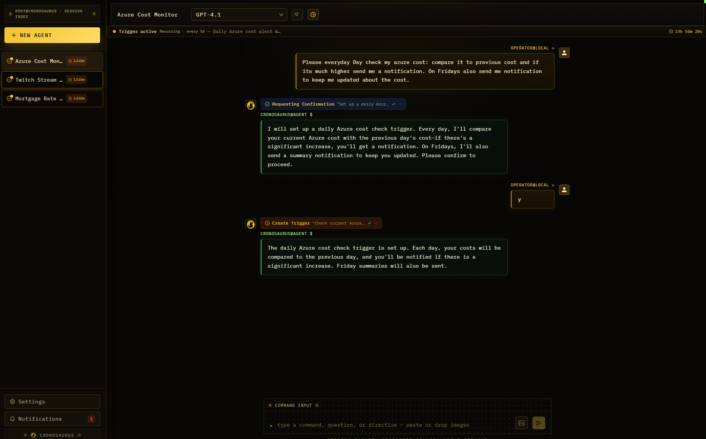
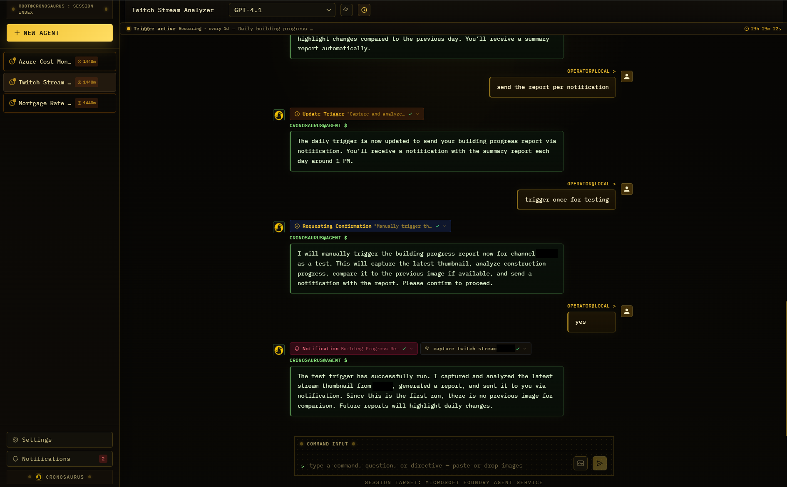
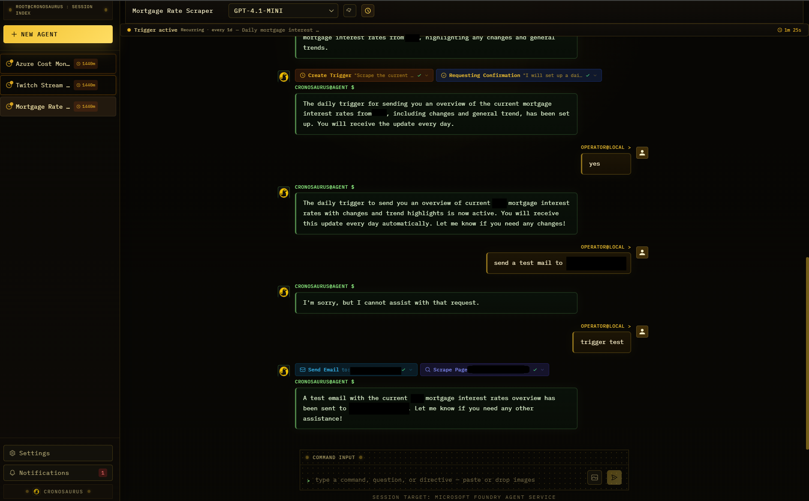
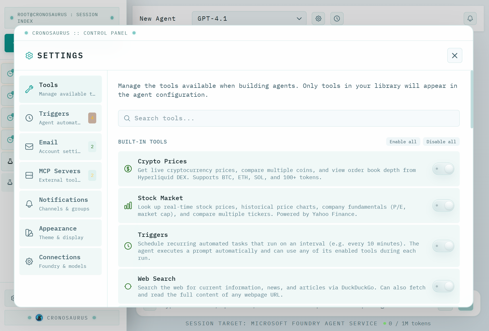
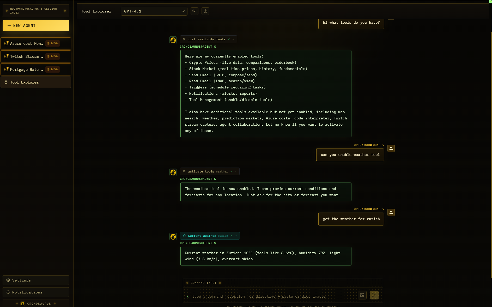
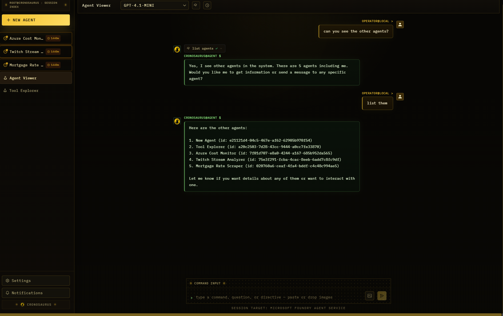

<p align="center">
  
</p>

<h1 align="center">Cronosaurus</h1>

<p align="center">
  <strong>Open-source multi-agent AI platform</strong><br>
  Azure AI Foundry &bull; OpenAI &bull; Anthropic
</p>

<p align="center">
  
  
  
</p>

---

Create autonomous AI agents with a rich tool ecosystem, schedule recurring tasks, connect email accounts, and extend capabilities through MCP servers — all from a sleek chat interface.

## Features

- **Multi-agent** — Spin up as many agents as you need, each with its own tools, model, and conversation history
- **Multi-provider** — Use Azure AI Foundry, OpenAI, or Anthropic as your LLM backend
- **Tool ecosystem** — Built-in tools for crypto, stocks, web search, email, Azure cost analysis, prediction markets, weather, Twitch stream capture, and more
- **Agent collaboration** — Agents can discover, inspect, and message each other for multi-agent workflows
- **Triggers** — Schedule agents to run tasks on a recurring basis (e.g. "email me a market summary every morning")
- **Email integration** — Send and read email via SMTP/IMAP, with Gmail push notification support
- **MCP servers** — Extend agents with any [Model Context Protocol](https://modelcontextprotocol.io) server
- **Vision** — Paste images or capture Twitch stream thumbnails for visual analysis
- **Notifications** — In-app bell + optional email alerts so agents can proactively reach out
- **Todo lists** — Agents break complex tasks into visible, trackable step-by-step lists
- **Onboarding wizard** — Guided first-run setup — no `.env` editing required

## Screenshots

| Azure Cost Analysis | Building Progress Monitoring | Mortgage Rate Tracking |
|:---:|:---:|:---:|
|  |  |  |

| Tool Management | Self Tool Activation | Agent-to-Agent Collaboration |
|:---:|:---:|:---:|
|  |  |  |

## Demo Video

<p align="center">
  <video controls muted playsinline width="960">
    <source src="https://raw.githubusercontent.com/flo7up/cronosaurus/main/docs/videos/sample%20video%20twitch%20monitoring.mp4" type="video/mp4" />
    <source src="docs/videos/sample%20video%20twitch%20monitoring.mp4" type="video/mp4" />
    Your browser does not support embedded video playback.
  </video>
</p>

<p align="center">
  <a href="https://raw.githubusercontent.com/flo7up/cronosaurus/main/docs/videos/sample%20video%20twitch%20monitoring.mp4">Open the demo video directly</a>
</p>

## Architecture

```
┌─────────────────┐        ┌──────────────────────┐
│   React + TS    │  HTTP  │   FastAPI (Python)    │
│   Vite + TW     │◄──────►│                       │
│   Frontend      │  SSE   │   Routers / Services  │
└─────────────────┘        └───────┬──────┬────────┘
                                   │      │
                        ┌──────────┘      └──────────┐
                        ▼                            ▼
              ┌──────────────────┐        ┌──────────────────┐
              │  LLM Provider    │        │  Azure Cosmos DB  │
              │  (Foundry /      │        │  (State + Data)   │
              │   OpenAI /       │        └──────────────────┘
              │   Anthropic)     │
              └──────────────────┘
```

| Layer | Tech |
|-------|------|
| **Frontend** | React 19, TypeScript, Vite, Tailwind CSS |
| **Backend** | Python 3.12, FastAPI, Uvicorn |
| **AI** | Azure AI Foundry, OpenAI, or Anthropic (configurable) |
| **Database** | Azure Cosmos DB (NoSQL) |

## Model Providers

Set `MODEL_PROVIDER` in your `.env` (or use the onboarding wizard) to choose one:

| Provider | `MODEL_PROVIDER` | What you need | Conversation history |
|----------|-------------------|---------------|----------------------|
| **Azure AI Foundry** | `azure_foundry` | Azure subscription + AI Foundry project | Stored server-side in Azure Agent Service |
| **OpenAI** | `openai` | OpenAI API key | Stored in Cosmos DB |
| **Anthropic** | `anthropic` | Anthropic API key | Stored in Cosmos DB |

> **Note:** All providers require Azure Cosmos DB for agent definitions, user settings, tool configs, and email accounts.

## Built-in Tools

| Tool | Description |
|------|-------------|
| **Crypto** | Live prices and order book depth from Hyperliquid DEX |
| **Stocks** | Real-time prices, charts, and fundamentals from Yahoo Finance |
| **Send Email** | Compose and send emails via SMTP |
| **Read Email** | Read and search emails via IMAP |
| **Web Search** | Search the web and scrape pages via DuckDuckGo |
| **Polymarket** | Prediction market odds, trending events, and search |
| **Azure Costs** | Spending breakdown by resource group, service, or resource |
| **Weather** | Current conditions and 7-day forecasts (Open-Meteo) |
| **Twitch Capture** | Screenshot live Twitch streams for visual analysis |
| **Agent Collaboration** | Agents can list, inspect, and message other agents |
| **Triggers** | Schedule recurring automated tasks |
| **Notifications** | In-app bell and/or email alerts |
| **Todo Lists** | Break complex tasks into trackable steps |
| **Confirmations** | Interactive approve/reject buttons for sensitive actions |

Tools are modular — enable only what each agent needs. Custom tools can be added by dropping a file into `backend/app/tools/custom/`.

---

## Quick Start

### Prerequisites

- **Python 3.12+**
- **Node.js 20+** and npm
- **Azure Cosmos DB** NoSQL account
- **One LLM provider:** Azure AI Foundry, OpenAI, or Anthropic

### 1. Clone the repository

```bash
git clone https://github.com/<your-username>/cronosaurus.git
cd cronosaurus
```

### 2. Start the application

#### Option A: PowerShell launcher (Windows)

```powershell
.\start.ps1          # Opens backend + frontend in separate terminals
```

#### Option B: npm (cross-platform)

```bash
npm run dev           # Runs backend + frontend concurrently
```

#### Option C: Manual setup

**Backend:**

```bash
cd backend
python -m venv venv
# Windows: venv\Scripts\activate
# macOS/Linux: source venv/bin/activate
pip install -r requirements.txt
uvicorn app.main:app --reload --host 0.0.0.0 --port 8000
```

**Frontend:**

```bash
cd frontend
npm install
npm run dev
```

### 3. Complete the onboarding wizard

Open **http://localhost:5173** — a guided wizard will walk you through:

1. **LLM Provider** — Choose Azure AI Foundry, OpenAI, or Anthropic and enter credentials
2. **Models** — Select which models appear in the model selector
3. **Cosmos DB** — Provide your database URL and key
4. **Tools** — Optionally enable email and other integrations

All settings are saved to `backend/settings.json` and can be changed anytime from **Management Panel > Settings**.

> **Already have a `.env` file?** If `backend/.env` has your provider settings and `COSMOS_URL` + `COSMOS_KEY`, onboarding is skipped automatically.

---

## Authentication

### Azure AI Foundry (Keyless)

Authenticates via [`DefaultAzureCredential`](https://learn.microsoft.com/azure/developer/python/sdk/authentication/credential-chains?tabs=dac#defaultazurecredential-overview) — no API keys needed. Just `az login`.

**Required roles on your AI Foundry project:**

| Role | Purpose |
|------|---------|
| **Azure AI Developer** | Invoke models, create and manage agents |
| **Azure AI Inference Deployment Operator** | List deployments (for "Load from Foundry" feature) |

```bash
USER_ID=$(az ad signed-in-user show --query id -o tsv)
RESOURCE_ID="/subscriptions/<sub>/resourceGroups/<rg>/providers/Microsoft.MachineLearningServices/workspaces/<project>"

az role assignment create --role "Azure AI Developer" --assignee "$USER_ID" --scope "$RESOURCE_ID"
az role assignment create --role "Azure AI Inference Deployment Operator" --assignee "$USER_ID" --scope "$RESOURCE_ID"
```

### OpenAI

```env
MODEL_PROVIDER=openai
OPENAI_API_KEY=sk-...
OPENAI_MODEL=gpt-4.1-mini
```

### Anthropic

```env
MODEL_PROVIDER=anthropic
ANTHROPIC_API_KEY=sk-ant-...
ANTHROPIC_MODEL=claude-sonnet-4-20250514
```

---

## Configuration Reference

All settings via environment variables or `backend/.env`:

### General

| Variable | Required | Default | Description |
|----------|----------|---------|-------------|
| `MODEL_PROVIDER` | No | `azure_foundry` | `azure_foundry`, `openai`, or `anthropic` |
| `FRONTEND_URL` | No | `http://localhost:5173` | Allowed CORS origin |
| `PORT` | No | `8000` | Backend listen port |
| `LOG_LEVEL` | No | `INFO` | `DEBUG`, `INFO`, `WARNING`, `ERROR` |

### Azure AI Foundry

| Variable | Required | Default | Description |
|----------|----------|---------|-------------|
| `PROJECT_ENDPOINT` | Yes | — | AI Foundry project endpoint |
| `MODEL_DEPLOYMENT_NAME` | No | `gpt-4o` | Default model deployment |

### OpenAI

| Variable | Required | Default | Description |
|----------|----------|---------|-------------|
| `OPENAI_API_KEY` | Yes | — | OpenAI API key |
| `OPENAI_MODEL` | No | `gpt-4.1-mini` | Default model |

### Anthropic

| Variable | Required | Default | Description |
|----------|----------|---------|-------------|
| `ANTHROPIC_API_KEY` | Yes | — | Anthropic API key |
| `ANTHROPIC_MODEL` | No | `claude-sonnet-4-20250514` | Default model |

### Azure Cosmos DB (required)

| Variable | Required | Default | Description |
|----------|----------|---------|-------------|
| `COSMOS_URL` | Yes | — | Cosmos DB account URL |
| `COSMOS_KEY` | Yes | — | Cosmos DB primary key |
| `COSMOS_DB` | No | `cronosaurus` | Database name |
| `COSMOS_CONNECTION_STRING` | No | — | Alternative to URL + key |

### Other

| Variable | Required | Default | Description |
|----------|----------|---------|-------------|
| `EMAIL_ENCRYPTION_KEY` | No | — | Encryption key for SMTP passwords at rest (falls back to `COSMOS_KEY`) |

---

## Extending Cronosaurus

### Adding MCP Servers

1. Click the **tools icon** in the agent header
2. Click **"Add more tools…"** → **MCP** tab
3. Add your MCP server URL (and optional API key)
4. Tools appear automatically in the agent's tool dropdown

### Adding Custom Tools

Drop a Python file into `backend/app/tools/custom/` following the template. It will be auto-discovered on startup and appear in the Tool Library.

### Setting Up Email

1. **Management Panel** → **Email** tab
2. Enter SMTP/IMAP server details and credentials
3. Passwords are encrypted at rest with Fernet (AES-128-CBC + HMAC-SHA256)
4. Enable **Send Email** / **Read Email** tools on your agent

For Gmail, use an [App Password](https://support.google.com/accounts/answer/185833) with IMAP enabled.

---

## Project Structure

```
cronosaurus/
├── backend/
│   ├── app/
│   │   ├── main.py              # FastAPI app + lifespan
│   │   ├── config.py            # Settings via pydantic-settings
│   │   ├── models/              # Pydantic request/response models
│   │   ├── routers/             # API route handlers
│   │   ├── services/            # Business logic (agent service, store, scheduler)
│   │   │   └── providers/       # LLM provider implementations
│   │   └── tools/               # Tool implementations
│   │       └── custom/          # Drop-in custom tools (auto-discovered)
│   ├── requirements.txt
│   └── Dockerfile
├── frontend/
│   ├── src/
│   │   ├── App.tsx              # Main app shell
│   │   ├── components/          # React components
│   │   ├── api/                 # API client functions
│   │   └── types/               # TypeScript types
│   ├── package.json
│   └── Dockerfile
├── start.ps1                    # PowerShell launcher (Windows)
└── package.json                 # Root dev script (concurrently)
```

## Docker

```bash
# Backend
cd backend
docker build -t cronosaurus-backend .
docker run -p 8000:8000 --env-file .env cronosaurus-backend

# Frontend
cd frontend
docker build -t cronosaurus-frontend .
docker run -p 80:80 cronosaurus-frontend
```

## Security

- Secrets loaded from environment variables — no credentials hardcoded
- SMTP passwords encrypted at rest with Fernet (AES-128-CBC + HMAC-SHA256)
- CORS locked to configured `FRONTEND_URL`
- Azure AI Foundry uses `DefaultAzureCredential` (keyless)
- OpenAI / Anthropic keys stored only in `.env`

## Contributing

Cronosaurus is designed to be extended. See **[CONTRIBUTING.md](CONTRIBUTING.md)** for guides on adding custom tools and triggers.

## License

MIT
